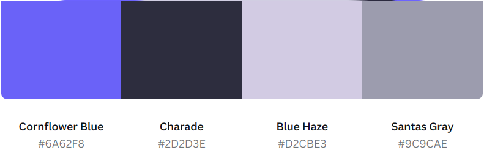

# Urbantrip
This is a social media for city trip lovers.

## Project management

The project was developed using the Kanban Agile management methodology and the MoSCoW prioritisation technique.

It was put in place using different functionalities in GitHub: 
* Issues, for EPICS and user stories;

An epic covers the development of an existing feature in the API.

User stories were linked to the epic to keep track of the progress with the tasks.

In order to better organise the flow of the work to do, I also created an epic for the set up and final deployment of the project.

* Milestone (without due date), for the product backlog;

Ready-for-development epics were stored in the product backlog before starting a sprint.

* Milestone (WITH due date), for each iteration;

I worked 1 epic x sprint.
User stories that couldn't be completed were placed back in the product backlog and on "No status" category of the project for eventually being included in a next sprint.

* Project, for the Kanban board.

Both the Urban-drf and  Urbantrip repositories were linked to the same project, Urbantrip-PP5.

Labels were used to identify epics and user stories of each repo.

Epics were assigned to the "To-do" status and move to "In progress" or "Done" status as the tasks in the user stories were completed.

[Back to top](#urbantrip)

## Design
### Typography

### Colours

## Technologies
 * [React-Bootstrap](https://react-bootstrap.netlify.app/), for styling support.
 * [React-Router](https://reactrouter.com/), for enabling "client side routing".
 * [axios](https://axios-http.com/),for fetching and posting data in the Urban-drf backend API.
 * [TinyMCE](https://www.tiny.cloud/), a WYSIWYG rich text editor for React.
 * [Favicon.io](https://favicon.io/)
 * [Balsamiq Wireframes for desktop](https://balsamiq.com/wireframes/desktop/), for creating the wireframes were created using.
 * [Canvas](https://www.canva.com/), for designing the logo and creating the color palette.
 * [React infinite scroll](https://www.npmjs.com/package/react-infinite-scroll-component), for loading post automatically as the user scrolls down.
   
[Back to top](#urbantrip-where-city-trip-lovers-meet)

## Credits
### Media
- Icons come from [uxwing](https://uxwing.com/)
- Images come from [rawpixel](https://www.rawpixel.com/)

### Code
- My mentor helped me to refine the code for the contact form.
- Code for hiding the nav bar in the Sign up and Sign in pages was inspired from this article: https://stackoverflow.com/questions/74277306/show-hide-navbar-or-footer-in-routes-with-react-router-dom-v6

- Upload video inspired on: https://www.upbeatcode.com/react/how-to-play-video-in-react/

[Back to top](#urbantrip-where-city-trip-lovers-meet)